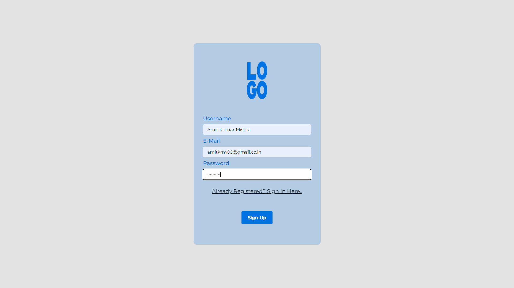
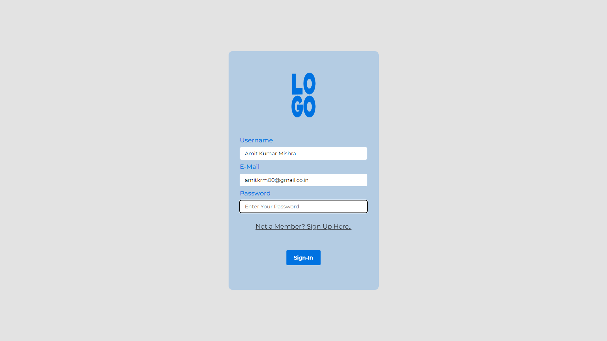
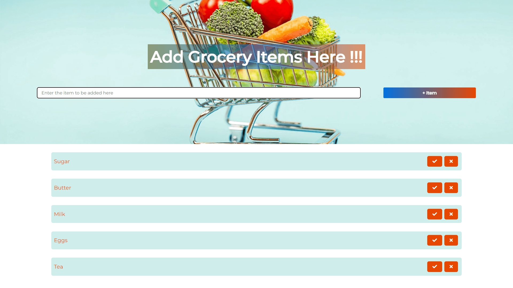

# grocery-manager-with-localstorage-login-page
**SignUp-Page** This Page would save the respective user details in browsers localstorage

**SignIn-Page** The  user now has to signin using the same details through which he had signed up

**Grocery Manager Page** Upon successful Sign-in, the user can finally get to the grocery-manager-page

